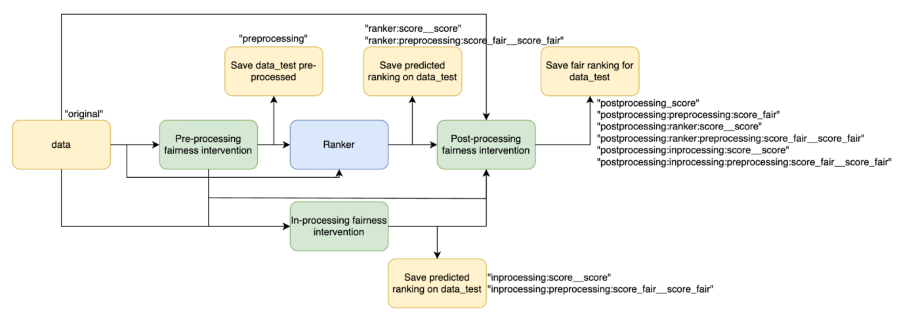
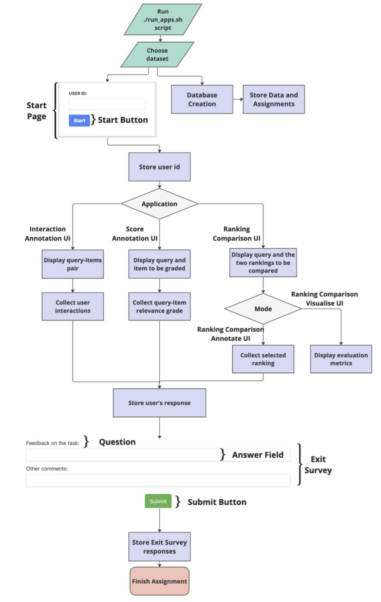

# Additional Support
## Ranklib Rankers
***Ready to Use*** <br>
The tool offers support for using any model implemented using the ranklib library[3]. It is to be considered that the ranklib library requires java to be installed in the docker container, thus, on the first run it might take longer for the app to start as it first needs to install java. It can be used by defining in the config file the following:
```
"train_ranker_config": {
"name": "Ranklib",
"model_path": "./dataset/<data_name>/models/Ranklib", // path to
save/load the model
 "settings": [{
     "features": ["feature_1", "feature_2", "feature_3"], // list of
features to be considered during training
     "pos_th": 0, // threshold to consider relevant documents
     "rel_max": 500, // maximum relevance that is assigned based on
the ‘score’ column
     "ranker": "RankNet", // ranker name
     "ranker_id": 1, // ranker id
     "metric": "NDCG", // metric to evaluate
     "top_k": 10, // evaluate at top-k
     "lr": 0.000001, // learning rate
     "epochs": 20, //number of epochs
     "train_data":["original"] // define the train data,
     "test_data": ["original"] //define the test data,
     "ranking_type": "ranker_1" }]}
```
For more information on how to use ranklib rankers check the ranklib documentation: https://sourceforge.net/p/lemur/wiki/RankLib%20How%20to%20use//.
<br>

The "train_data" and "test_data" can be set to the following values:
- "original"-thegroundtruthissettobetheoriginalscore
- <ranking_type>-if the ground truth is set to be the score computed using a fairness intervention. 
<br>

The train method saves the input files in the format expected by the ranklib library under ./dataset/<data_name>/models/Ranklib/<train_data>_<test_data>. The model and predictions are saved under ./dataset/<data_name>/models/Ranklib/<train_data>_<test_data>/ranklib_experimen ts/<ranker_name>. <br>

The output of the predict method returns a new dataframe that is in the same format as the original one with an appended column representing the predicted score. The column with the predicted relevance should follow the convention <train_column>__<test_column>. For example if the train and test data is set to be “original”, the predicted score column should be ”score”__”score”, where “score” is the value defined in the config file under the “score” field. If the train and test data are pre-processed by a fairness intervention the predicted score column should be “score“_fair__“score“_fair.
<br>
The new ranking based on the predicted score is saved in the MonogDB database in the collection dataset, in the field rankings. Given the config presented above, the ranking type of saved in the database will be set to ranker_1:“score“__“score“. If a preprocessing fairness intervention is applied on the train/test data, the ranking type saved in the database will be set to ranker_1:preprocessing_1:“score“_fair__“score_fair“

<br>

***Add a new Rankers***

In order to add a new ranker the following steps should be followed:
- Under ./src/rankers create the following python file: ranker_<ranker_name>.py. Inside the python file create the class that implementes the ranker method:
```
class <ranker_name>Ranker(Ranker):
                def __init__(self, configs, data_configs,
                model_path):
                           super().__init__(configs,data_configs,
                      model_path)

```
  - model_path - path to save/load the model
  - configs - dictionary of hyperparameters needed to run the ranker. This is defined in the config file as “settings”.
  - data_configs - dictionary of configs defined for the 
  - data_reader_class. This is needed to be able to access the required columns by the fairness intervention.
- Implement the methods defined in the parent class Ranker, which can be found in ./src/fairness_interventions/ranker.py.
  ```
  def train_model(self, data_train, data_test, experiment)
    data_train - data to train the model
    data_test - data to evaluate the model during training experiment - tuple containing the <train_ranking_type> and <test_ranking_type> defined in the configuration file.
    The train method should save the trained model at the following path:
    self.model_path/<train_ranking_type>__<test_ranking_ type>.
  def predict(self, data, experiment)
    data - data to run the model on and generate the predicted ranking experiment - tuple containing the <train_ranking_type> and <test_ranking_type> defined in the configuration file.
    The predict method should load the model from self.model_path/<train_ranking_type>__<test_ranking_ type> and apply it on the data.
    The method should return a new dataframe that is in the same format as data with an appended column representing the predicted score. The column with the predicted score should follow the convention <train_score_column>__<test_score_column>.
    For example if the <train_ranking_type> and <test_ranking_type> is set to be “original”, the predicted score column should be ”score”__”score”. If the train and test data are pre-processed by a fairness intervention the predicted score column should be ”score”_fair__”score”_fair, where “score” is the value defined in the config file under the “score” field.
  ```
- If needed any files related to the fairness method can be saved under ./src/rankers/modules/<ranker_name>
- Define the new ranker in ./src/constants in the dictionary containing the rankers.
- Using the new ranker:
```
"train_ranker_config": {
"name": "<ranker_name>" // same as the key defined in the
   dictionary,
        "model_path":
   "./dataset/<data_name>/models/<ranker_name>", // path to
   save/load the model
"settings": [{
// define any configs needed to run the ranker "features": ["feature_1", "feature_2", "feature_3"],
   // list of features to be considered during training
"train_data":["original"], // define the train data
                "test_data": ["original"], //define the test data
                "ranking_type": "ranker_1"
                }]}

```

## Fairness Intervention

***Ready to Use*** <br>
The tool supports applying:
- post-processing fairness intervention: FA*IR[2]. It can be used by defining in the config file the following:
```
"post_processing_config": {
       "name": "FA*IR",
       “model_path”: “”, //empty as there is no model to save
       "settings": [{
            "k": 10,
            "p": 0.7,
            "alpha": 0.1
            "ranking_type": "postprocessing_1"}]
}

```

- pre-processing fairness intervention: CIF-Rank. It can be used by defining in the config file the following:
```
 "pre_processing_config": {
            "name": "CIFRank",
            "model_path": "./dataset/<data_name>/models/CIFRank", // path
      to save/load the model
            "settings": [{
                   "pos_th": 0, //threshold to consider positive documents
                   "control": "group_value", //control group, the group
                  towards which we convert all the data in a counterfactual
                  world
                   "features": ["field_1", "field_2", "field_3"]//list of
            features (columns from the dataframe) to be considered as
            mediators
}] }

```

It is to be considered that the fairness interventions might require additional libraries to be installed in the docker container, thus, on the first run it might take longer for the app to start as it first needs to install the required libraries.

## Add a new fairness method
In order to add a new fairness intervention the following steps should be followed:
- Under ./src/fairnes_interventions create the following python file: fairness_method_<method_name>.py. Inside the python file create the class that implementes the fairness method:
  ```
  class <method_name>(FairnessMethod):
                  def __init__(self, configs, data_configs, model_path):
                        super().__init__(configs, data_configs, model_path)

  ```
    - model_path - path to save/load the model
    - configs - dictionary of hyperparameters needed to run the fairness method. This is defined in the config file as “settings”.
    - data_configs - dictionary of configs defined for the data_reader_class. This is needed to be able to access the required columns by the fairness intervention.
- Implement the methods defined in the parent class FairnessMethod, which can be found in ./src/fairness_interventions/fairness_method.py.
    ```
    def train_model(self, data_train)
               data_train - data to train the model
    ```
    The train_model method should save the fairness intervention method to self.model_path.
    ```
    def generate_fair_data(self, data):
               data - data to be used to generate the fair data

    ```
    The generate_fair_data method should return a new dataframe that has the same columns as data, to which the fair columns are added following the name convention <column_name>_fair.<br>
    For example, when running a pre-processing fairness intervention like CIF- Rank[1], both the features defined under “features” and the score define under “score” will be changed. The fair columns should be “score”_fair,where “score” is the value defined in the config file under the “score” field, and same for all the features defined under “features”. When running a post-processing intervention like FA*IR[2], which re-ranks the candidates, then the fair column should represent the new ranking, thus, the name of the returned column is rank_fair.
- If needed any files related to the fairness method can be saved under ./src/fairness_interventions/modules/<method_name>.
- Define the new fairness method in ./src/constants in the dictionary containing fairness methods.
- Using the new fairness method:
  ```
    "name": "<method_name>" 
    "model_path": "./dataset/<data_name>/models/<method_name>", 
    "settings": [{
        "train_data":["original"],
        "test_data": ["original"], 
        "ranking_type": ["original"]}]

  ```


The figure below describes how the fairness interventions can be applied on the data and how their outputs can be used to train a ranking model, if the configuration file has enabled the use of both the fairness interventions and the use of a ranking model. The Pre-processing fairness intervention is applied on the data and saved in the database. As mentioned before, the fair values are saved in the documents collection, while the fair ranking is saved in the dataset collection. The Ranker, the In-processing fairness intervention and the Post-processing fairness intervention can be trained/tested on either the pre-processed data or on the original data. This can be set in the configuration file using the field "train_data" and "test_data". The predicted rankings are saved in the database in the collection dataset. The post-processing method can be applied on any kind of ranking, including the ranking based on the original “score” column, the ranking based on the output of the fairness interventions or of the ranker. The predicted rankings are saved in the database under the dataset collection.




Given the following example of a configuration for the post-processing intervention using
FA*IR:

```
"post_processing_config": {
 "name": "FA*IR",
 "model_path": "",
 "settings": [{
      "k": 10,
      "p": 0.7,
      "alpha": 0.1,
"test_data": ["original", "preprocessing_1", "ranker_1:preprocessing_1:qualification_fair__qualification_fair", "ranker_1:qualification__qualification"],
      "ranking_type": "postprocessing_1"}]

```

The post-processing fairness intervention will be applied on the following rankings:
- "original" - the ranking produced by column “score”
- "preprocessing_1" - the ranking produced by the pre-processed score column (qualification_fair)
- "ranker_1:preprocessing_1:qualification_fair__qualification_fair" - the ranking produced by ranker_1 which was trained on the qualification_fair column produced by the pre-processing method defined as preprocessing_1.
- "ranker_1:qualification__qualification" - the ranking produced by ranker_1 which was trained on the qualification column.

The ranking_type of the ranking saved in the database are defined as it follows for the above use cases:
- postprocessing_1:qualification
- postprocessing_1:qualification_fair
- postprocessing_1:ranker_1:preprocessing_1:qualification_fair__
     qualification_fair
- postprocessing_1:ranker_1:qualification__qualification

## Run the tool
AnnoRank is designed to be easy to use. We provide easy to run examples, that can be used to tailor the app to specific needs, as well as a step by step tutorial. The figure below depicts the workflow of the AnnoRank application.



### Requirements
AnnoRank utilizes docker containers to handle our applications and database. The docker- compose command directs the machine to construct the necessary containers and their dependencies as outlined in the docker-compose file. This includes installing the necessary python packages to run the app as well as other requirements such as Java to be able to make use of the Ranklib library, or R to be able to run the pre-processing fairness intervention. Depending on the use of the app one can comment out or add the dependecises in the docker-compose file. To make use of other python packages the env.yml file needs to be updated. Thus, the AnnoRank web apps can be effortlessly deployed on any web hosting server.
- Install Docker by following the steps presented here:
[Docker Installation](https://www.digitalocean.com/community/tutorials/how-to-install-and-use-docker-on-ubuntu-18-04) Select the operating system of the device you want to run the app on and proceed with the steps indicated.
- Install [Docker Desktop]( https://www.docker.com/products/docker-desktop/) to be able to monitor the docker instances.
- Install [MongoDB Compass](https://www.mongodb.com/products/tools/compass) to view the dataset created and its collections. The connection should be set as mongodb://<IP>:27017. <IP> should be set to IP address for of the machine where the docker container is running.
- If you are using Windows make sure you have WSL2. Allow WSL2 usage in
docker settings.

Starting the app is easy and straightforward as one needs to only define the desired configuration files and run the script run_apps.sh. Add the paths to the configuration files needed to run the app in: apps.docker.sh. <br>

The script will lunch the creation of the docker container, the population of the database with the specified dataset, and the web apps. After starting the app, the web apps will be accessible at the following URLs:
- Interaction Annotation UI: http://localhost:5000/start_ranking/<exp\_id>
- Score Annotation UI: http://localhost:5003/start_annotate/<exp\_id>
- Ranking Comparison Visualise UI: http://localhost:5001/start_compare/<exp\_id>
- Ranking Comparison Annotate UI: http://localhost:5002/start_compare_annotate/<exp\_id>

The ports where the apps are running are defined in the docker-compose file, if needed one can change the ports to other values. The <exp_id> is the ID of the assignment to be displayed to the users which was defined in the experiment file and stored in the collection experiment.

