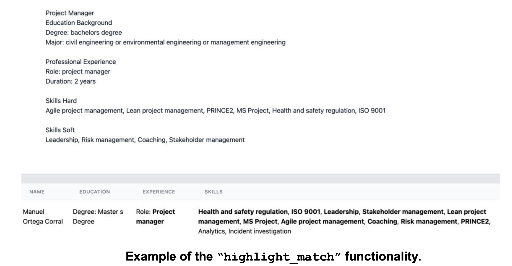

# Configuration File

Under ./configs create a josn file which represents the configurations with which to run the tool with the desired dataset. 

- “data_reader_class” - Configuration for the data.
  - “name” - Specify the dataset name you want to run the tool with.
  - “score” - Column to be used for ranking the documents.
  - “group” - Column to be used by the fairness interventions representing the
sensitive information of the documents (e.g. gender).
  - “query” - Column representing the query to which the document is linked to. This
should contain the same values found in dataframe_queries under ‘title’. “docID” - Column representing the document IDs.  

- “ui_display_config” - Configuration for what to display in the UI. “highlight_match” - Option to highlight the matching words of the query in the item’s display field.
  - “display_fields” - List of columns to display.
  - “task_description” - guidelines of how the user should perform the assessment.
  - “exit_survey” - List of questions to be asked in the exit survey.
  - “question” - The question to be displayed.
  - “field” - The field name that will be used to store the value in the database.
  - “options” - If a drop-down is wanted, list of options to be shown in the drop-down, otherwise set the value to “text” to display a free text input. “mandatory” - Boolean to be set if the field is mandatory to be completed by the user or not.  

Specific fields to declare for the Interaction Annotation UI:
- “shortlist_button” - Boolean value for whether to display the shortlist button. 
- “shortlist_select” List representing the range [min, max] of top-k items the user has to select as being the most relevant for the given query.
- “view_button” - Boolean value for whether to display or not the view button. “view_fields” - List of columns to display when clicking on the view button.
- “view_fields” - List of columns to display when clicking on the view button.

Specific fields to declare for the Score Annotation UI:
- “score_range“ - range for the score bar (e.g [1,5]), with the first value being the start of the range and the second value being the last value from the range. The score bar will have 5 circles starting with values from 1 to 5.

Specific fields to declare for the Ranking Comparision UI:
- “annotate” - Boolean to be set to true if wanting to run the Ranking Compare Annotate UI, or set to false if wanting to run Ranking Compare Visualise UI. “avg_interaction” - Configuration for the interactions to be displayed.
  - “avg_interaction” - Configuration for the interactions to be displayed.
  - “experiment_id” - Experiment ID out of which we want to visualise the collected interactions.
  - “interaction” - Interaction type to be displayed (e.g. “n_views” - clicks on the view button).
- “display_metrics” - Configuration for metrics to be displayed. 
  - “top_k” - Compute the metric at @k.
  - “utility_metrics” - List of utility metrics to be computed and displayed.
  - “fairness_metrics” - List of fairness metrics to be computed and displayed.
- “attention_check” - Configuration to define which task is the attention check. 
  - “task” - The task to be considered as the attention check. 
  - “correct_answer” - The correct answer expected for this task. It should be defined as list of documents for the Interaction Annotation UI. For the Score Annotation UI it should be the value of the correct label.
  
- “iaa” - Configuration for the inter-annotator agreement
  - “krippendorfs” - Boolean to be set to true to compute Krippendorf’s IAA [6] 
  - “cohens” - Boolean to be set to true to compute Cohen’s Kappa IAA [5] “weighted_cohens” - Boolean to be set to true to compute Weighted Cohen’s Kappa [7]
  - “filter_per_task” - Boolean to be set to true if wanting to compute the IAA per task

“train_ranker_config” - Configuration for applying a ranker on the original ranking. If set to null, no ranker will be applied to the original ranking, otherwise, the documents will be ranked based on the predicted score by the defined ranker.
“name” - Name of the ranker to be applied.
“model_path” - Path to load a pre-trained model. If no pre-trained model is
available, a new model will be saved at the specified path.
“settings” - List of configurations to run the ranker (specify your own fields used by the ranker class). The ranker class should be initialised with the settings specified.
“ranking_type” - Specify under which tag the ranking of the documents should be saved in the database.
- ranker_<name> - for running a ranking model

- “pre/in/post_processing_config” - Configurations to apply a pre-processing fairness intervention on the data. If set to null, no ranker will be applied to the original ranking, otherwise, the documents will be ranked based on the predicted score by the defined ranker.
  - “name” - Name of the method to be applied.
  - “model_path” - Path to load a pre-trained model. If no pre-trained model is available, a new model will be saved at the specified path.
  - “settings” - List of configurations to run the method (specify your own fields used by the fairness intervention class). The fairness intervention class should be initialised with the settings specified.
  - “ranking_type” - Specify under which tag the ranking of the documents should be saved in the database. It is important to keep the following naming convention for the ranking type:
    - preprocessing_<name> - for running a preprocessing fairness intervention.
    - postprocessing_<name> - for running a postprocessing fairness intervention.
    - inprocessing_<name> - for running an in-processing fairness intervention.

