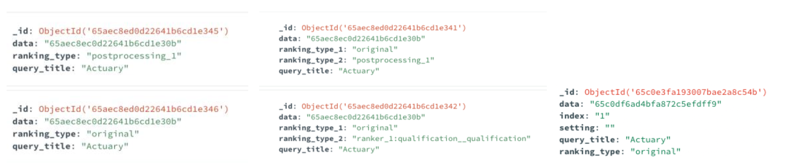

# Database

Source code documentation for database pipeline [Database Pipeline](Database_Pipeline.md) 
Source code documentation for database structure in MongoDB [MongoDB Database Structure](Database_Structure.md) 

The tool works with a MongoDB database. The diagram below describes the collections present in the database. For each dataset, a new database is created automatically together with the required collections. The name of the created dataset will be the name specified in the configuration file as the “data_reader_class”. Below the use of each collection is described:
- documents - stores the data frame describing the data to be displayed, meaning the data stored in data_test. On top of the fields displayed in the
diagram, the tool automatically adds the rest of the columns present in data_test. The preprocessing field stores a list with preprocessed values given the configurations of the ranking_type.

- queries - stores the data frame describing the queries, meaning the data stored in dataframe_queries.

- dataset - stores the query-rankings pairs. For each pair,it stores the id of the query and a list of rankings. Each ranking stores an ordered list of the IDs of the documents linked to this query. The lists are ordered based on the ranking_type that was defined in the configuration file.

- experiments - stores the data defined in the experiment file, including the list of tasks to be displayed when running the tool. On the left there is an example belonging to an experiment file used to run the Interaction Annotation UI, while on the right an example belonging to an experiment file used to run the Ranking Compare UI. The corresponding tasks can be seen under the next point: on the left for the Interaction Annotation UI and on the right for Ranking Compare UI.

- tasks/tasks_compare/tasks_score-storesthedatadescribedinthe experiment file for each task, together with the ID of the query-ranking pair stored in the dataset collection. On the left, there is an example belonging to collection tasks, while in the middle an example belonging to collection tasks_compare, and on the right an example belonging to collection tasks_score.

- user - stores the ID provided by the user on the first page of the tool and the list of tasks the user interacted with in the tool. As the user interacts with the tool, for each task viewed we store the ID of the tasks together with the list of collected interactions for each document.

## Exporting Data

Export Data
The collected data can be exported by either running the following command:
mongoexport --host="<mongo\_hostname>:<mongo\_port>" --collection=<collection\_name> --db=<db\_name> --out=<output>.json or from the MongoDB Compass interface1 as either json or csv files.

## Database schema

