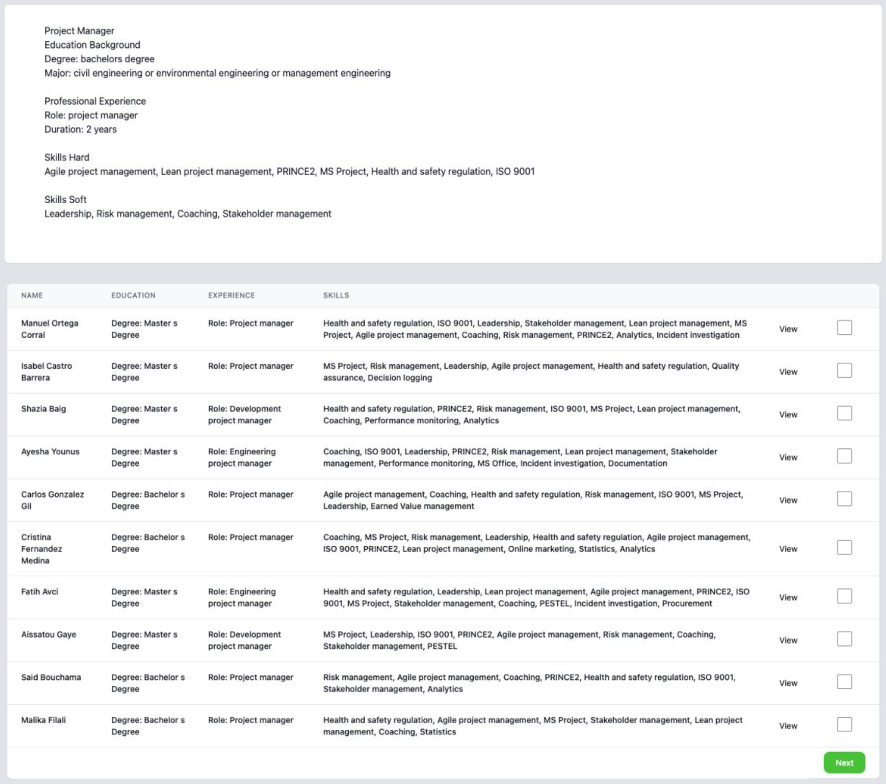
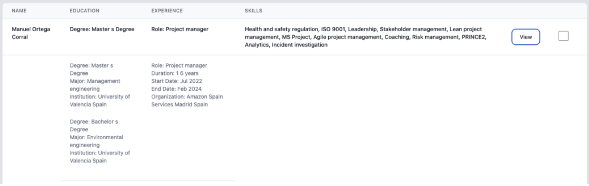
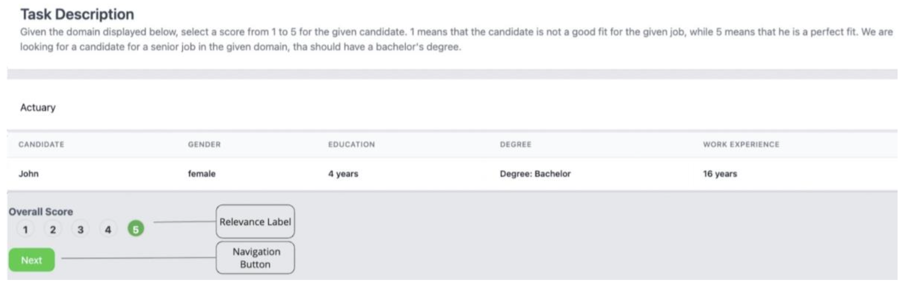
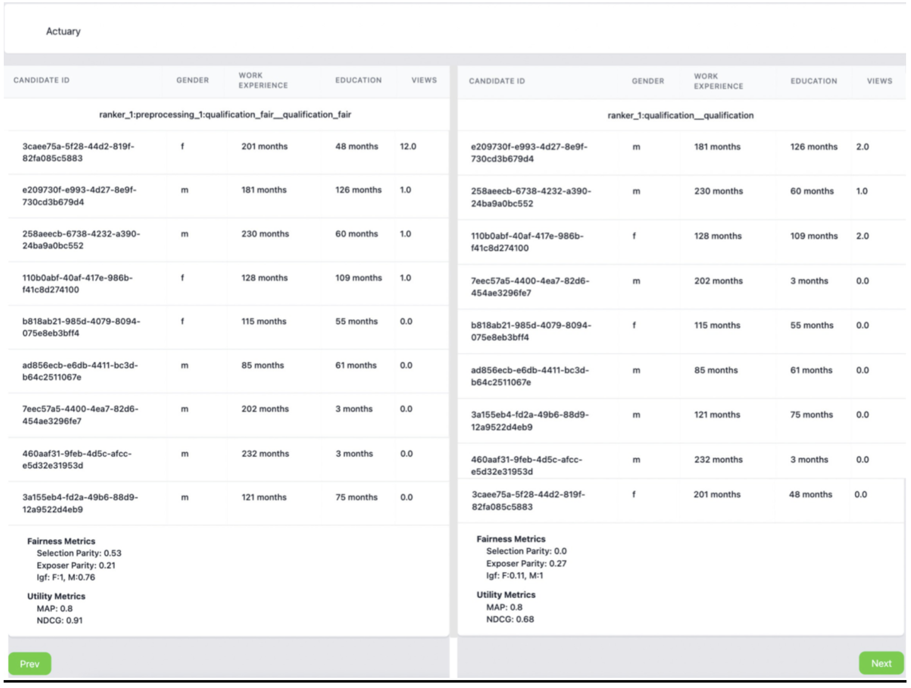
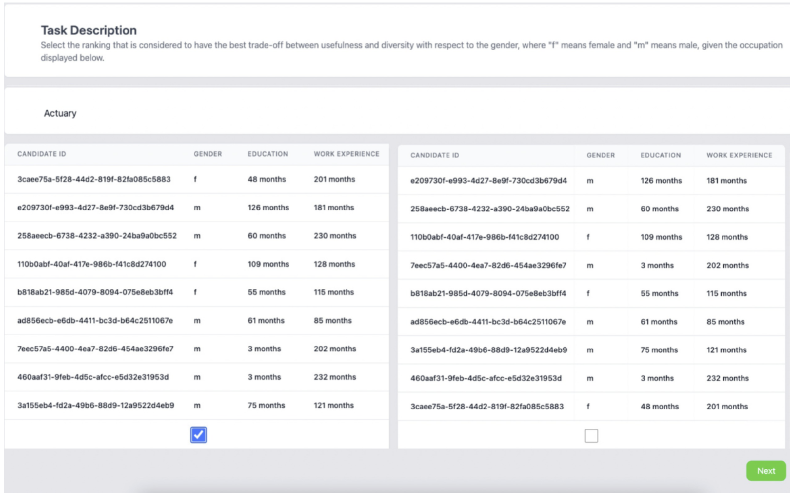

# UI Functionalities
## Collection of User Data

When interacting with the tool the users will be first asked to provide an ID with which they
will be registered in the database. The user can interact with the UI by typing in the empty
field the ID and then clicking start. All interactions will be collected during the session for
each user ID. <br>

At the end of the interaction with the tool, the users can be asked to complete an exit survey in which one can collect feedback or demographic data about the user. An example of an exit survey can be seen below. This can be configured to include other fields. More details about the configuration of the Exit Survey can be found under the section Configuration File. The user can interact with the UI by typing in the empty fields (e.g. feedback field) or by choosing an option from a drop-down (e.g. gender field), then when clicking submit all the collected values are stored in the database for the corresponding user ID. <br>

## Display Interaction Annotate UI (Ranking Annotate UI)
Source code documentation: [Ranking App](Ranking_App.md)<br>


In the option for displaying a query-ranking pair the UI will show in the top of the page the query, and in the bottom of the page the list of documents. The user can interact with the UI in the following ways:
 - **View Button**: the user can expand the table to view more information about the document. When the user clicks on another View Button, the current expand will close. Only, one expand can be open at a time. <br>
    
 - **Check Box**: the user can select top-k documents that are the most relevant given the displayed query. If the predefined minimum and maximum of selected documents is not met, the UI will display an alert to the user.
 - **Next Button**: the user can navigate to the next query using the Next Button.

For each user, the following interactions can be collected:
- **Clicks**: number of clicks for each document on the View Button
- **Timestamps**: for each click the timestamp of the click to open the expand and the
timestamp of closing the expand are collected.
- **Top-k Documents**: the list of the selected documents in the order in which the user
checked the box

#Integration with BigBrother Logging Tool
On top of the above mentioned, AnnoRank is integrated with the BigBrother logging tool. The BigBrother logging tool is one of the application-independent services, with minimal configuration to the web-based user interface [8]. See here [BigBrother logging tool](https://github.com/hscells/bigbro). <br>

The tool can record the **mouse clicks** and **movements** of the annotators. The logs are stored in the ./dataset/<data_name>/big_borther.log file. <br>

To collect mouse clicks insert this script into the html body:
```
<script type="text/javascript">
BigBro.init('**{{session_id}}**', "localhost:1984", ["click", "onload"]);
</script>
```

To collect mouse movements insert this script into the html body: 

```
<script type="text/javascript">
BigBro.init('**{{session_id}}**', "localhost:1984", ["mousemove", "onload"]);
</script>
```

The **session_id** is the **"user_id"** of the current annotator. <br>
Below is an example of the Big Brother logging tool output for clicks when used in the
Interaction Annotation UI app: <br>


```
2024-06-03 09:50:26.303 +0000
UTC,**3456**,click,INPUT,shortlist,1,http://localhost:5000/start_ranking/1/
index_ranking/0/view,1229,423,1360,807,
2024-06-03 09:50:26.693 +0000
UTC,**3456**,click,INPUT,shortlist,2,http://localhost:5000/start_ranking/1/
index_ranking/0/view,1233,508,1360,807,
2024-06-03 09:50:27.14 +0000
UTC,**3456**,click,TD,,,http://localhost:5000/start_ranking/1/index_ranking
/0/view,1239,587,1360,807,
```

Below is an example of the BigBrother logging tool output for the mousemove in score
Annotation UI:
```
2024-06-03 11:19:25.017 +0000
UTC,**23445**,mousemove,H4,,,http://localhost:5003/start_annotate/2/index_a
nnotate/1,692,450,1360,807,
2024-06-03 11:19:25.033 +0000
UTC,**23445**,mousemove,H4,,,http://localhost:5003/start_annotate/2/index_a
nnotate/1,949,368,1360,807,
2024-06-03 11:19:25.05 +0000
UTC,**23445**,mousemove,DIV,,,http://localhost:5003/start_annotate/2/index_
annotate/1,1129,336,1360,807,
2024-06-03 11:19:25.069 +0000
UTC,**23445**,mousemove,DIV,,,http://localhost:5003/start_annotate/2/index_
annotate/1,1303,322,1360,807,
```

The logs follow the structure:
```
<Time of logged event>, <User identifier> , <Method causing the event>, <HTML element>, <Name of HTML element> , <ID of HTML element> , <URL> ,<X position> ,<Y position> , <ScreenWidth> , <ScreenHeight> , <Comment>
```

## Score Annotate UI
Source code documentation: [Annotate Document App](Annotate_Document_App.md)<br>

    

In the option for annotating a document by giving it a score, the UI will show in the top of the page the query, and in the bottom of the page document. The user can interact with the UI in the following ways:
- **Score Bar**: the user can give a score to the document by clicking on the numbers in the score bar.
- **Next Button**: the user can navigate to the next query using the Next Button.


For each user, the following interactions can be collected:
- **Score**: the score the user things the document should receive given the displayed
query and the task description.
- **Next Button**: the user can navigate to the next query using the Next Button.

For each user, the following interactions can be collected:
- **Score**: the score the user things the document should receive given the displayed
query and the task description.

## Display Ranking Comparison UI
Source code documentation: 
[Ranking Compare App](Ranking_Compare_App.md)<br>
[Ranking Compare Annotate App](Ranking_Compare_Annotate_App.md)<br>

### Ranking Compare Visualize metrics UI


On top of this, this UI can be used by the researcher to compare rankings produced using different ranking methods or evaluate the impact of a fairness intervention. The UI has the option to display metrics for each ranking, as shown in the bottom of the UI. Moreover, if interaction data is available, the UI can display the average of the interactions collected by the users. The navigation between several ranking comparison can be performed using the Prev/Next Button. <br>

### Evaluation Metrics supported by AnnoRank
The utility metrics that can be displayed are computed using the Pytrec eval library[4] on the displayed ranking. The ready to use fairness metrics that the tool offers are: selection parity, parity of exposer, and IGF (in group fairness). Selection parity measures whether the selection rates between the two groups in the top-k are equal. The parity of exposure measures whether a group's exposure is equal to the exposure of the other group at the top. Lower values mean the ranking offers equal representation/exposure among the groups. IGF is computed as the ratio between the lowest accepted score and the highest rejected score of a group at the top. Higher values mean more in group fairness.<br>

### Ranking Compare Annotate UI


Additionally, the comparison UI could be configured to collect annotations by asking the user to indicate which returned list of items is more suitable, given the query. In the option for displaying a ranking comparison, the UI will show in the top of the page the query, and below the two rankings to be compared. <br>


The user can interact with the UI in the following ways:
- **Check Box**: depending on the task, the user can choose which ranking is more
suitable for the displayed query.
- **Next Button**: the user can navigate to the next query using the Next Button.

For each user, the following interactions can be collected:
- **Best Ranking**: the chosen ranking by the user to be more suitable for the displayed
query.